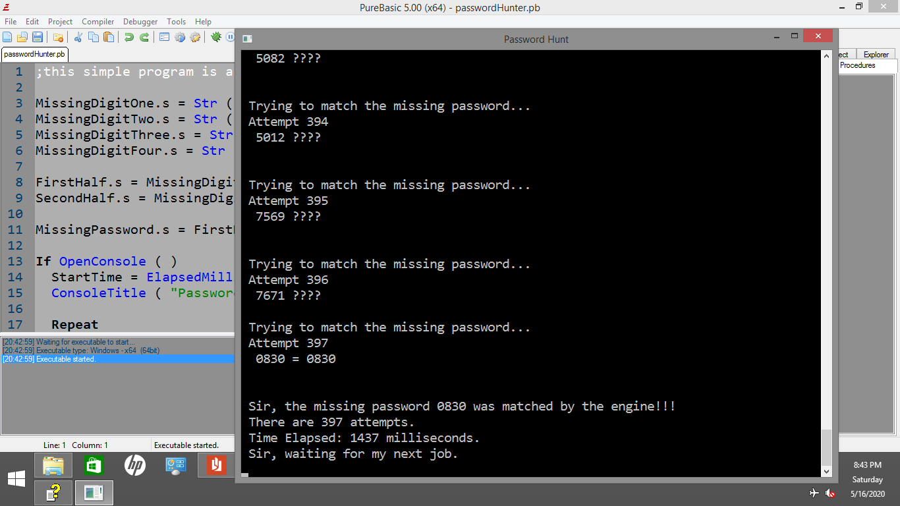

# PureBasic Password Hunter

This is a very simple program for beginners who want to practice loops
and conditional statements. It will continue to look for the match
and will break out of the loop once there is the match.

Just see the code and enjoy the simplicity!

## The Good Old Days
PureBasic was my first ever programming language, so it reminds me of the good old days. 
Before PureBasic, I first learned Excel formulas, which really captured my interest. 
The very first time I encountered Excel was in college,
and it was the IF function presented by the professor that really caught my attention.

## Disclaimer
Please note that this project is presented as a showcase of my work during a 
specific period. It represents a snapshot of my skills and accomplishments 
at that time. As such, this project is no longer actively maintained or updated. 
It is kept public for demonstration purposes and may not reflect my current 
abilities or the latest best practices in the field.

## Compiling
Just click `Compile/Run` button in your PureBasic IDE
or press F5.

## License
MIT - the permissive license

## More PureBasic Projects
for more PureBasic discussion and other details,
check the Main Page -> [PureBasic](https://github.com/jdevfullstack/PureBasic)
